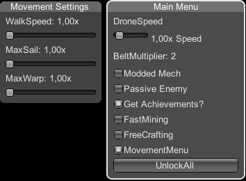

# Dyson-Sphere-Programm-ModMenu

Simple ModMenu for Dyson Sphere Programm, feel free to work on it and get it better.
im pretty new to modding Unity Games, so don't expect something crazy.

Need BepinEx to Work. https://github.com/BepInEx/BepInEx

Insert key - Toggle "show Menu"

Modded Mech Features:  
-Mecha Miningspeed * 2  
-Mecha Walkspeed * 1.3  
-Mecha CraftSpeed * 10  
-Mecha Energy always Max  
-Mecha HP always Max  
-Mecha Laser Rapidfire  
-Mecha Laser Damage * 10  

